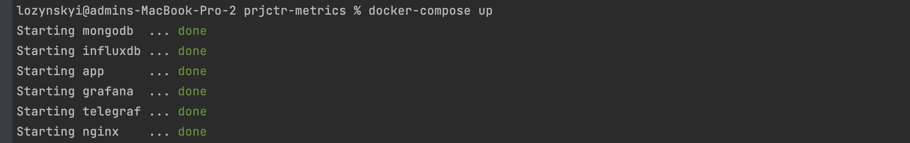
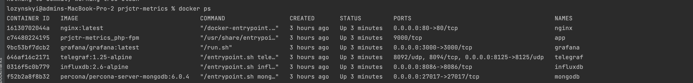
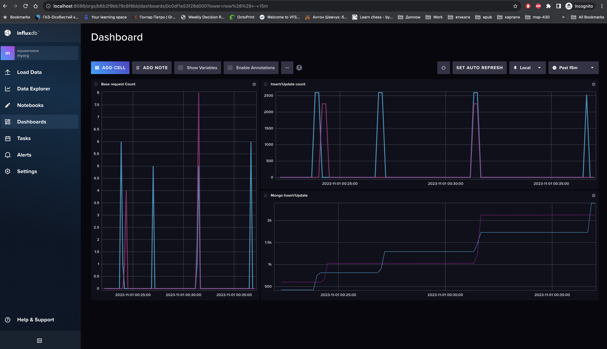
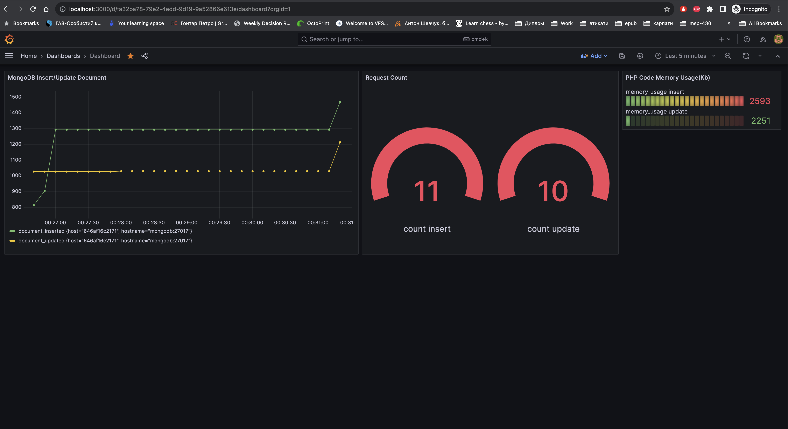

# Projector-Metrics

This project use TIG (Telegraf, InfluxDB and Grafana) stack to show load in system. Also NGINX-PHP-MONGO for show all system in work
For more info look at **docker-compose.yml**

**Folders structure:**

app -- PHP code executions with integrations to influxdb

docker -- Helpers/volumes/config for all docker container

**Installation:**

    docker-compose up --build

**Result on photo:**

**Check working of containers**

    docker ps

**Visit nginx(php script will be called) with random count of mongodb insert/update**
    
    http://localhost/insert

    http://localhost/update

**Visit influxdb WEB interface user/password -- (myusername/passwordpasswordpassword):**
    
In influxdb:2.6 was enabled web interface and new version has ability like (grafana) to show stats

    http://localhost:8086/

**Visit grafana user/password -- (admin/secure_password):**

(In case dashboard didnt show, import file from docker/grafana/dashboards/dashboard.json)

    http://localhost:3000/

